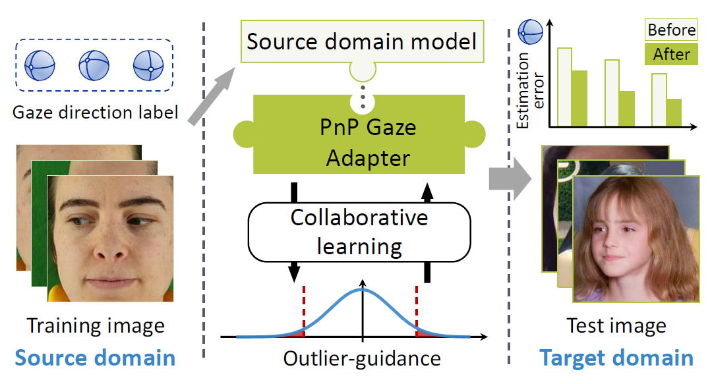
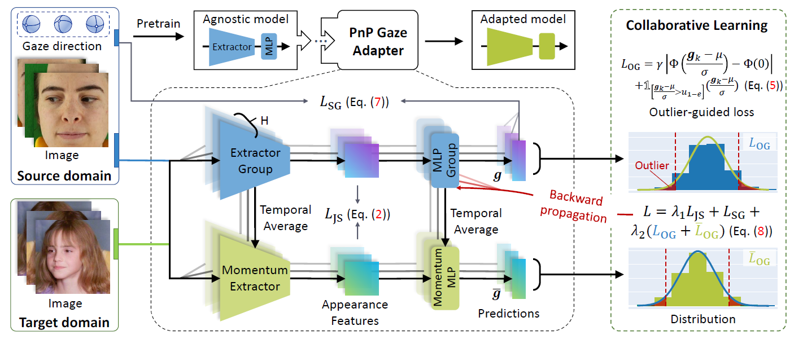

# Generalizing Gaze Estimation with Outlier-guided Collaborative Adaptation


 Our paper is accepted by **ICCV2021**. 

<div align=center>   </div>

**Picture:**  *Overview of the proposed Plug-and-Play (PnP) adaption framework for generalizing gaze estimation to a new domain.*

<div align=center>   </div>

**Picture:**  *The proposed architecture.*

---

**Results**

|   Input    | Method               |                 D<sub>E</sub>→D<sub>M</sub>                  |                 D<sub>E</sub>→D<sub>D</sub>                  |                 D<sub>G</sub>→D<sub>M</sub>                  |                 D<sub>G</sub>→D<sub>D</sub>                  |
| :--------: | -------------------- | :----------------------------------------------------------: | :----------------------------------------------------------: | :----------------------------------------------------------: | :----------------------------------------------------------: |
|    Face    | Baseline             |                            8.767                             |                            8.578                             |                            7.662                             |                            8.977                             |
|    Face    | Baseline + PnP-GA    | **5.529** <span style="color:darkred;font-size:13px;">↓36.9%</span> | **5.867** <span style="color:darkred;font-size:13px;">↓31.6%</span> | **6.176** <span style="color:darkred;font-size:13px;">↓19.4%</span> | **7.922** <span style="color:darkred;font-size:13px;">↓11.8%</span> |
|    Face    | ResNet50             |                            8.017                             |                            8.310                             |                            8.328                             |                            7.549                             |
|    Face    | ResNet50 + PnP-GA    | **6.000** <span style="color:darkred;font-size:13px;">↓25.2%</span> | **6.172** <span style="color:darkred;font-size:13px;">↓25.7%</span> | **5.739** <span style="color:darkred;font-size:13px;">↓31.1%</span> | **7.042** <span style="color:darkred;font-size:13px;">↓6.7%</span> |
|    Face    | SWCNN                |                            10.939                            |                            24.941                            |                            10.021                            |                            13.473                            |
|    Face    | SWCNN + PnP-GA       | **8.139** <span style="color:darkred;font-size:13px;">↓25.6%</span> | **15.794** <span style="color:darkred;font-size:13px;">↓36.7%</span> | **8.740** <span style="color:darkred;font-size:13px;">↓12.8%</span> | **11.376** <span style="color:darkred;font-size:13px;">↓15.6%</span> |
| Face + Eye | CA-Net               |                              --                              |                              --                              |                            21.276                            |                            30.890                            |
| Face + Eye | CA-Net + PnP-GA      |                              --                              |                              --                              | **17.597** <span style="color:darkred;font-size:13px;">↓17.3%</span> | **16.999** <span style="color:darkred;font-size:13px;">↓44.9%</span> |
| Face + Eye | Dilated-Net          |                              --                              |                              --                              |                            16.683                            |                            18.996                            |
| Face + Eye | Dilated-Net + PnP-GA |                              --                              |                              --                              | **15.461** <span style="color:darkred;font-size:13px;">↓7.3%</span> | **16.835** <span style="color:darkred;font-size:13px;">↓11.4%</span> |


This repository contains the official PyTorch implementation of the following paper:

> **Generalizing Gaze Estimation with Outlier-guided Collaborative Adaptation**<br>
Yunfei Liu, Ruicong Liu, Haofei Wang, Feng Lu<br> <!-- >  https://arxiv.org/abs/1911.09930  -->
> 
>**Abstract:**   Deep neural networks have significantly improved appearance-based gaze estimation accuracy. However, it still suffers from unsatisfactory performance when generalizing the trained model to new domains, e.g., unseen environments or persons. In this paper, we propose a plugand-play gaze adaptation framework (PnP-GA), which is an ensemble of networks that learn collaboratively with the guidance of outliers. Since our proposed framework does not require ground-truth labels in the target domain, the existing gaze estimation networks can be directly plugged into PnP-GA and generalize the algorithms to new domains. We test PnP-GA on four gaze domain adaptation tasks, ETH-to-MPII, ETH-to-EyeDiap, Gaze360-to-MPII, and Gaze360-to-EyeDiap. The experimental results demonstrate that the PnP-GA framework achieves considerable performance improvements of 36.9%, 31.6%, 19.4%, and 11.8% over the baseline system. The proposed framework also outperforms the state-of-the-art domain adaptation approaches on gaze domain adaptation tasks.

## Resources

Material related to our paper is available via the following links:

- Paper: https://arxiv.org/abs/2107.13780
- Project: https://liuyunfei.net/publication/iccv2021_pnp-ga/
- Code: https://github.com/DreamtaleCore/PnP-GA

## System requirements

* Only Linux is tested, Windows is under test.
* 64-bit Python 3.6 installation. 

## Playing with pre-trained networks and training

### Config

You need to modify the config.yaml first, especially `xxx/image`, `xxx/label`, and `xxx_pretrains` params.

`xxx/image` represents the path of label file.

`xxx/root`  represents the path of image file.

`xxx_pretrains`  represents the path of pretrained models.

A example of label file is `data` folder. Each line in label file is conducted as:

```bash
p00/face/1.jpg 0.2558059438789034,-0.05467275933864655 -0.05843388117618364,0.46745964684693614 ... ...
```

Where our code reads image data form `os.path.join(xxx/root, "p00/face/1.jpg")` and reads ground-truth labels of gaze direction from the rest in label file.

### Train

We provide three optional arguments, which are `--oma2`, `--js` and `--sg`. They repersent three different network components, which could be found in our paper.

`--source` and `--target` represent the datasets used as the source domain and the target domain. You can choose among `eth, gaze360, mpii, edp`.

`--i` represents the index of person which is used as the training set. You can set it as -1 for using all the person as the training set.

`--pics` represents the number of target domain samples for adaptation.

We also provide other arguments for adjusting the hyperparameters in our PnP-GA architecture, which could be found in our paper.

For example, you can run the code like:

```bash
python3 adapt.py --i 0 --pics 10 --savepath path/to/save --source eth --target mpii --gpu 0 --js --oma2 --sg
```

### Test

`--i, --savepath, --target` are the same as training.

`--p` represents the index of person which is used as the training set in the adaptation process.

For example, you can run the code like:

```bash
python3 test.py --i -1 --p 0 --savepath path/to/save --target mpii
```

## Citation

If you find this work or code is helpful in your research, please cite:

```latex
@inproceedings{liu2021PnP_GA,
  title={Generalizing Gaze Estimation with Outlier-guided Collaborative Adaptation},
  author={Liu, Yunfei and Liu, Ruicong and Wang, Haofei and Lu, Feng},
  booktitle={Proceedings of the IEEE/CVF International Conference on Computer Vision},
  year={2021}
}
```

## Contact

If you have any questions, feel free to E-mail me via: `lyunfei(at)buaa.edu.cn`
